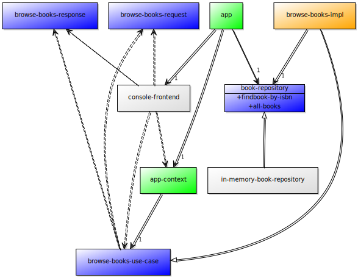

Clean Architecture Exploration
==============================

This directory contains a Lisp application for browsing a database of
books.  The application attempts to use a [Clean Architecture][ca] as
described by Uncle Bob Martin in various talks and blog posts.

  [ca]: https://blog.8thlight.com/uncle-bob/2012/08/13/the-clean-architecture.html

The goal of Clean Architecture is to have the directory structure of
your application shout out what your application does rather than what
framework was used to present your application or what database is
nestled in the depths of your application.  Your program is divided
into Entities, Use Cases, and Interface Adapters.

Entities encapsulate "Enterprise-wide business rules."  Use Cases
encapsulate "Application-specific business rules."  Interfaces and
Adapters represent how your Use Cases want to interact with the
outside world (e.g. databases, users, printers, etc.).

In Clean Architecture, the Entities cannot know that the Use Cases
exist and the Use Cases cannot know anything about the Adapters except
for the Interface to them which is defined by the Use Case rather than
by the Adapter.  The Use Case does not know whether the application is
being used from the command-line or from the web or from a remote
service calling into it.  The Use Case does not know whether the data
is being stored in the file system or in a relational database.
Nothing in the Adapters can know anything about the Entities.

Simple Example
--------------

I have a project that I am just starting.  I thought I would use this
new project to see how Clean Architecture works for me.

There are large number of talks and videos about Clean Architecture.
However, there are not many examples of it despite several years of
[Stack Overflow][so] questions and [blog posts][show] asking for
examples.

   [so]: http://programmers.stackexchange.com/questions/149656/are-there-any-examples-of-uncle-bobs-high-falutin-architecture
 [show]: http://www.techdarkside.com/dear-uncle-bob-please-please-show-me-the-code

There are a few simple examples around the web.  The most notable is
Mark Paluch's [Clean Architecture Example][ex].  It is just big enough
to get a sense of how things hang together.  If you're willing to put
up with Java's insane directory hierarchies, you can get a pretty good
idea of what the application does just by poking around the Use Cases
directory.

  [ex]: https://www.paluch.biz/blog/83-clean-architecture-code-examples-for-an-onion-architecture.html

My First Use Case
-----------------

My first Use Case is to let the User browse the a list of Book
Summaries.  The User should be able to sort by Title, Author,
Publication Date, or Date the Book was acquired.  The User should be
able to filter the list based upon Genre or Keyword.  The Use Case
should allow the caller to implement pagination, so the Use Case needs
to support returning up to a given number of Book Summaries starting
with a specific number.

But, let's start with baby steps.

The Simplified Version of my First Use Case
-------------------------------------------

Let's just say the User wishes to see a list of all of the Book
Summaries.

This simple version of the Use Case is implemented in this repository
under the tag `the-dream`.

The architecture consists of some simple structures with no "business
logic" in them at all: `book-summary` and `book`.  It consists of one
use case `browse-books` which defines the use-case interface
`browse-books-use-case` along with its input structure
`browse-books-request` and its output structure
`browse-books-response`.  It defines the method `browse-books` which
must be called with a `browse-books-use-case` instance, a
`browse-books-request` instance, and `browse-books-response` instance.

In my implementation, the `browse-books-response` is a simple data
structure.  One could easily imagine that the `browse-books` method
would return one rather than filling one in that was passed to it.  In
some variants of Clean Architecture (like the Paluch example cited
above), the response model is a class instance upon which a method is
called to complete the interaction.  I'm not sure what one gains by
this.  In some cases, it might provide you with an easy way to let the
response happen asynchronously, but it seems unlikely that all of the
Adapters calling your code would be okay with that sudden change in
synchrony.  And, your Use Case has to dictate how it is used, it
cannot make assumptions or references to whomever invoked it except by
calling methods on the response model which the Use Case defined.

The use case also defines the `book-repository` interface that it
needs.  In the Paluch example, all of the use cases share the same
repository interfaces.  In several of Uncle Bob's videos, he makes the
claim (or claims equivalent to the claim) that each use case should
define an interface for just the methods it needs to use on a Book
repository.  In this use case, it would need only the ability to
retrieve the list of Books.  In other use cases, it might instead need
the ability find a Book based on its ISBN.

I wrote `browse-books-impl` class which extends the
`browse-book-use-case`.  It takes an instance of `book-repository` on
construction.  It uses that to retrieve the list of Books.  Then, it
creates a `book-summary` from each `book` instance retrieved from the
`book-repository`.

To test the design so far, I wrote `in-memory-book-repository` backend
which implements the `book-repository` interface that was defined in
the Use Case.  I also wrote a `console` frontend which invokes the
`browse-books-use-case`.

To tie it all together, I wrote `app-context` which holds the current
`browse-books` instance.  And, I wrote the `app` which creates an
instance of the `in-memory-book-repository` and creates the
`browse-books-impl` for the `app-context`.  Then, it runs the main
loop of the `console` frontend.

Trouble In Paradise
-------------------

Already, in this simple interface, I am torn.  For this Use Case, I do
not need the repository to return me the list of Books.  I could,
instead, ask the repository to return me the list of Book Summaries.
If I do that, my application is just a fig-leaf over the repository.

Well, the argument against asking the repository for Book Summaries is
that it should not be up to the database to decide how I would like to
have my Books summarized.  That certainly seems like it should be
"business logic" and probably "application specific" business logic at
that.

So, fine.  I will have the repository return Books and the Use Case
will summarize them.

Now, let me extend the Use Case the next little bit forward.  What if
I want to support pagination?  My choices are to push the pagination
down to the repository so that I can ask it to give me up to 20 Books
starting with the 40th Book.  Or, I can let the repository give me all
of the books and do the pagination in the Use Case.

Here, I can find no guidance in any of the Clean Architecture videos
that I have watched nor in the examples that I have found online.
Everyone seems happy with the repositories being able to return one
item given that item's unique identifier or return all of the items.

If the repository is going to return all of the Books, then why
wouldn't my Use Case just return them all and leave the caller to do
any pagination that is needed?

This works fine when there are a few dozen books and they are
small.  It does not scale, and I don't know how it is supposed to
scale without pushing most of the responsibility onto the repository.

Sure, I can push the responsibility onto the repository.  But, one of
the reasons that Clean Architecture is so structured is to allow easy
testing of all of the application logic.  The more that I push into
the repository, the less that I actually exercise when I run my unit
tests with my mock repository (and the more complex my mock repository
should probably be).
